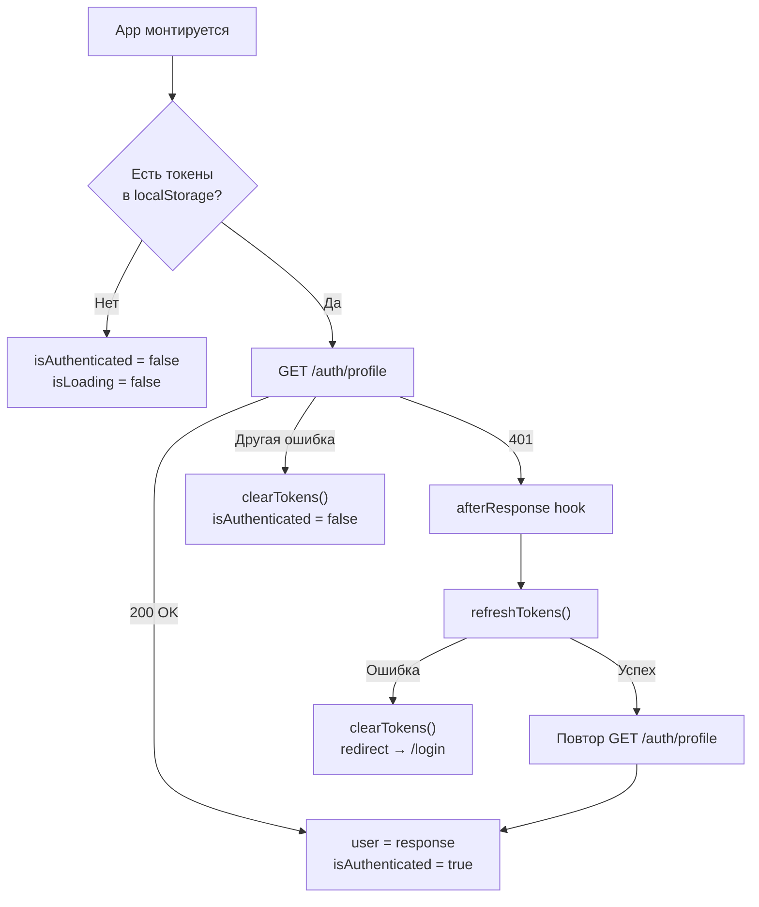
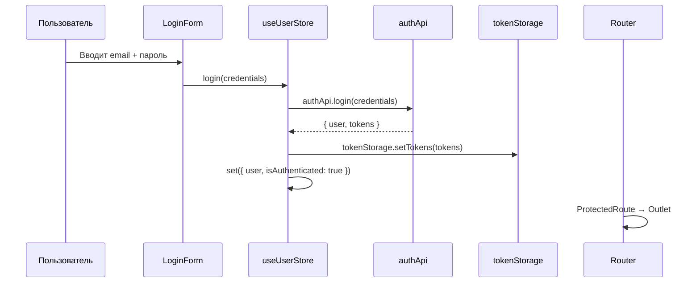
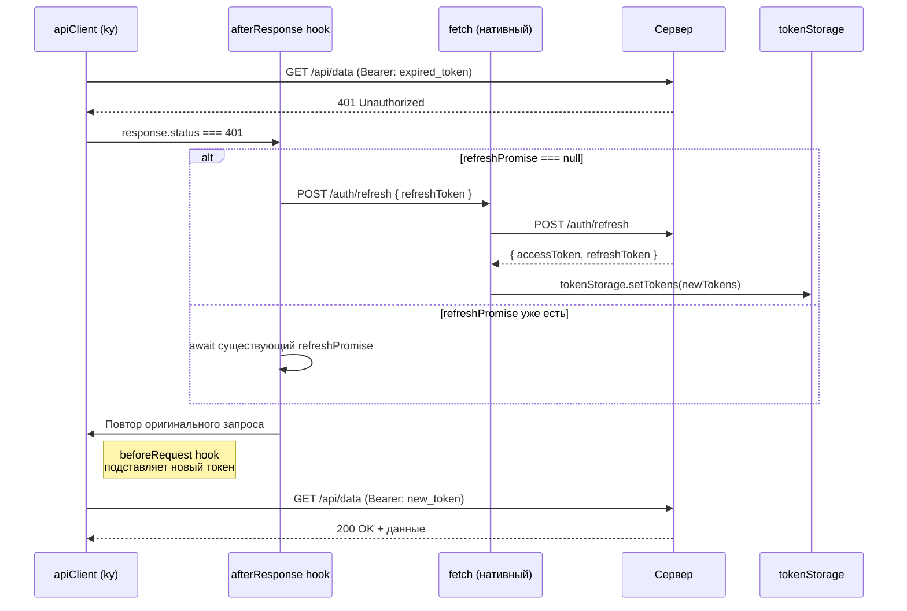
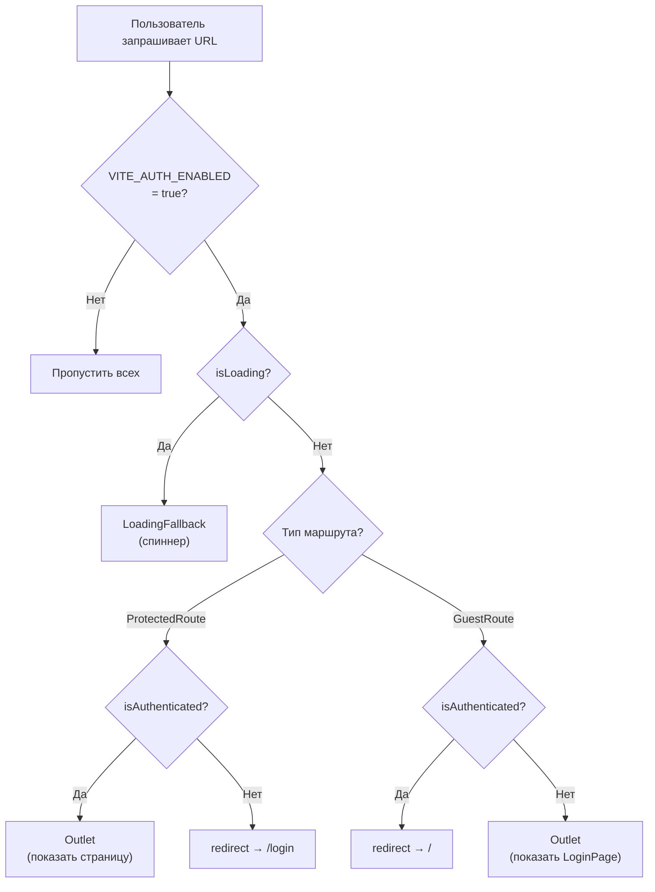

# Поток авторизации (Auth Flow)

Данный документ описывает архитектуру системы аутентификации:
как происходит вход, выход, проверка сессии и автоматическое обновление токенов.

---

## Общая схема: Кто за что отвечает

| Файл                 | Слой FSD      | Ответственность                                        |
| -------------------- | ------------- | ------------------------------------------------------ |
| `httpClient.ts`      | shared/api    | Инъекция Bearer-токена, silent refresh при 401         |
| `tokenStorage`       | shared/lib    | CRUD-операции с access/refresh токенами в localStorage |
| `user.api.ts`        | entities/user | Сетевые запросы: login, register, logout, getProfile   |
| `useUserStore.ts`    | entities/user | Zustand-стор: состояние юзера + бизнес-логика auth     |
| `ProtectedRoute.tsx` | app/router    | Route guard: редирект на /login если не авторизован    |
| `GuestRoute.tsx`     | app/router    | Reverse guard: редирект на / если уже авторизован      |
| `env.ts`             | shared/config | Feature flag `VITE_AUTH_ENABLED`                       |

---

## Диаграмма 1: Инициализация приложения (checkAuth)

Вызывается один раз при монтировании `AppProviders`.



---

## Диаграмма 2: Вход (login)



---

## Диаграмма 3: Silent Refresh (автоматическое обновление токена)



> **Почему `fetch`, а не `ky`?** Запрос на refresh не должен попадать в `afterResponse` hook `apiClient`, иначе получим бесконечный цикл: refresh → 401 → refresh → 401 → ...

> **Race-condition protection:** Если 3 запроса одновременно получают 401, только первый запускает `refreshTokens()`. Остальные два ждут (`await refreshPromise`) тот же промис.

---

## Диаграмма 4: Маршрутизация (Route Guards)



---

## Feature Flag: `VITE_AUTH_ENABLED`

Если `VITE_AUTH_ENABLED=false` (по умолчанию):

- `ProtectedRoute` пропускает всех без проверки
- `GuestRoute` перенаправляет на `/` (страницы Login/Register недоступны)
- `checkAuth` всё равно вызывается, но быстро завершается (нет токенов → `isLoading=false`)

---

## Обработка ошибок

Все ошибки API типизированы через класс `ApiError`.
Коды ошибок сгруппированы по доменам в `API_ERROR_CODES`:

| Домен        | Примеры кодов                                                          |
| ------------ | ---------------------------------------------------------------------- |
| `auth`       | `AUTH_UNAUTHORIZED`, `AUTH_INVALID_CREDENTIALS`, `AUTH_ACCOUNT_LOCKED` |
| `validation` | `VALIDATION_EMAIL_ALREADY_EXISTS`, `VALIDATION_WEAK_PASSWORD`          |
| `resource`   | `RESOURCE_NOT_FOUND`, `RESOURCE_CONFLICT`                              |
| `server`     | `SERVER_INTERNAL`, `SERVER_UNAVAILABLE`                                |
| `network`    | `NETWORK_TIMEOUT`, `NETWORK_CONNECTION_REFUSED`                        |

### Пример обработки в store

```typescript
try {
  const response = await authApi.login(credentials);
  tokenStorage.setTokens(response.tokens);
} catch (err) {
  if (err instanceof ApiError) {
    if (err.is(API_ERROR_CODES.auth.INVALID_CREDENTIALS)) {
      state.error = 'Неверный email или пароль';
    } else if (err.is(API_ERROR_CODES.auth.ACCOUNT_LOCKED)) {
      state.error = 'Аккаунт заблокирован';
    }
  }
}
```

### Пример обработки в компоненте

```typescript
const { error } = useApiQuery(productKeys.lists(), (signal) =>
  productApi.getAll(signal),
);

if (error instanceof ApiError && error.is(API_ERROR_CODES.resource.NOT_FOUND)) {
  return <Result status="404" title="Товары не найдены" />;
}
```
